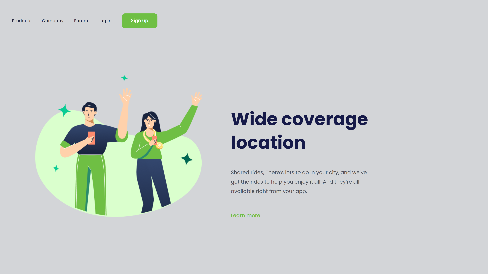

# Wide Coverage Location 

> Projeto DevClub

Projeto construído no desafio do curso do DevClub.

[ 🔗 Clique aqui para acessar](https://antoniofarjala.github.io/Wide-coverage-location)

## 💻 Tecnologias

- HTML
- CSS
- Git e Github

## 📧 Contato

antoniofarjala@gmail.com